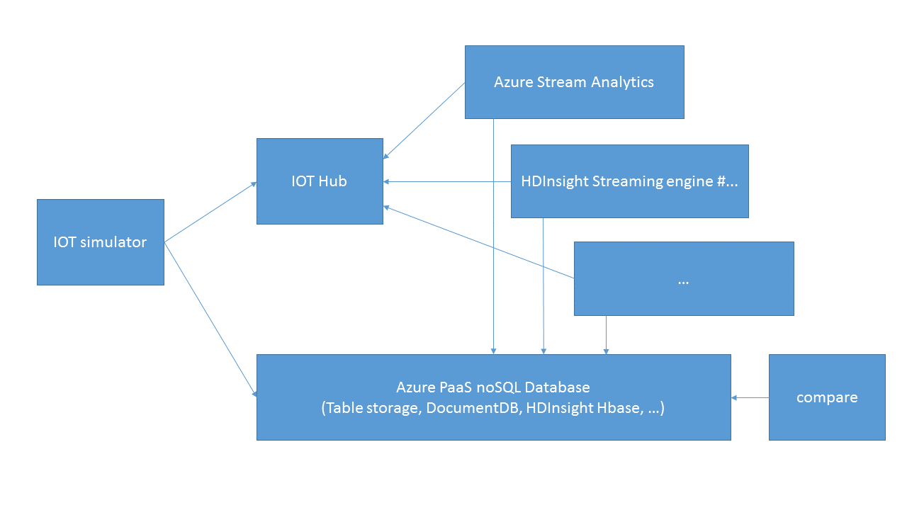

# boontadata-paas

boontadata sceanarios implemented with Azure Platform as a Service

This repo is a project related to [boontadata-streams](https://github.com/boontadata/boontadata-streams) in terms of scenarios. 
The main difference is that it is meant to run only on Microsoft Azure, while boontadata-streams may run in any Docker hosts. 
It also leverages Azure PaaS.

Here is what the scenario looks like: 

